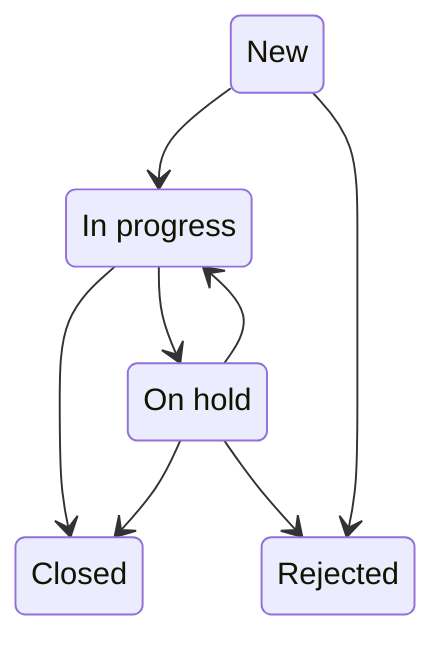

# OpenProject Workflow Visualiser
This script parses a downloaded HTML of the Administration>Workflow page in OpenProject and extracts the default workflow of the previously selected role and type as a Mermaid stateDiagram-v2.

## Example

