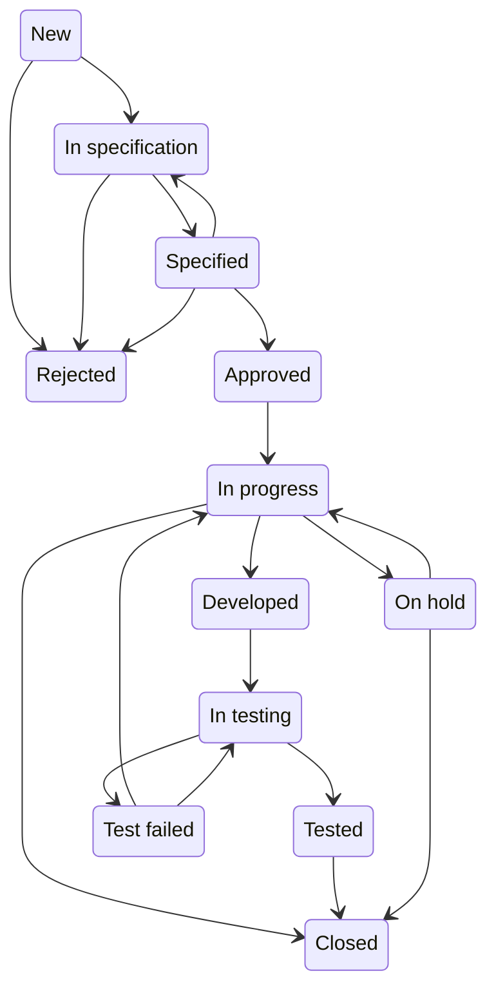
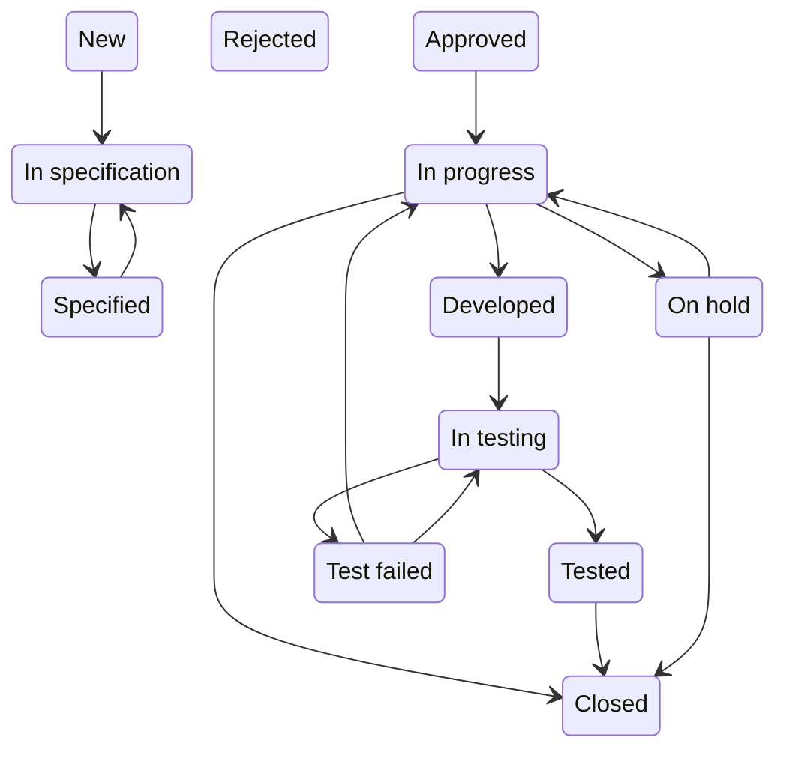
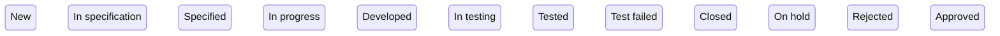

# OpenProject Workflow Visualiser
This script parses a downloaded HTML of the Administration>Workflow page in OpenProject and extracts the default workflow of the previously selected role and type as a Mermaid stateDiagram-v2. It's recommended to download the workflow page with the checkmark set for only showing states used by the type. 

In case you have mermaid-cli installed on your system and mmdc in your '$PATH', you can use the '-o' option to output a PNG rendering of your diagram. This option won't output a markdown representation.

## Example (role: Project Manager, type: Epic)
In this example the role is allowed to act on all states or the work package.

## Example (role: Member, type: Epic)
In this example the role is not allowed to transfer to or from certain states. As "Rejected" is used in the work package type it is shown without any lines leaving or entering this state.

## Example (role: Reader, type: Epic)
The role in this example doesn't have any rights to adjust states.

