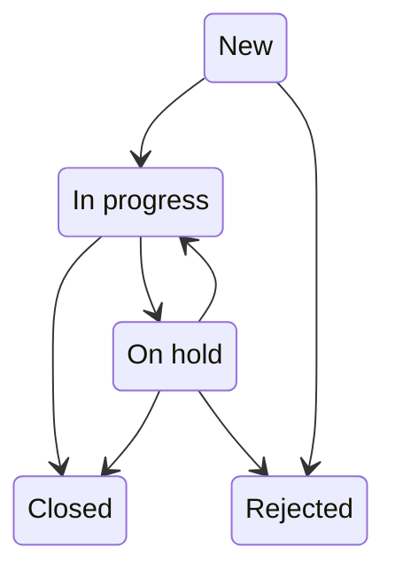
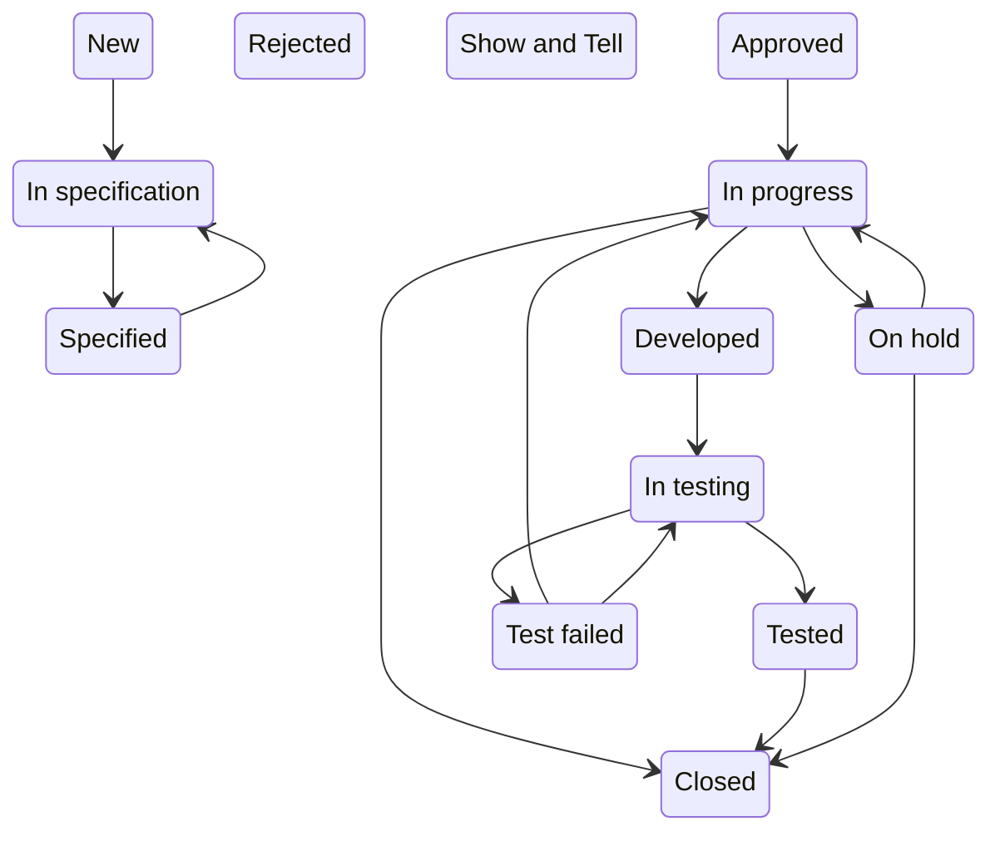

# OpenProject Workflow Visualiser
This script parses a downloaded HTML of the Administration>Workflow page in OpenProject and extracts the default workflow of the previously selected role and type as a Mermaid stateDiagram-v2. It's recommended to download the workflow page with the checkmark set for only showing states used by the type. 

## Example 1

## Example 2
In this example the role is not allowed to transfer to or from certain states. As "Rejected" and "Show and Tell" are used in the work package type they are shown without any lines leaving or entering this state.

